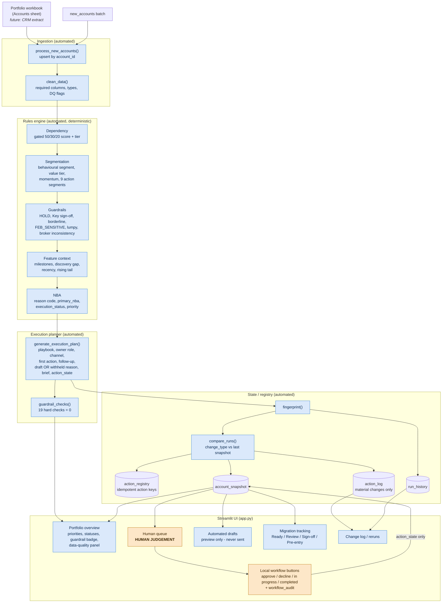
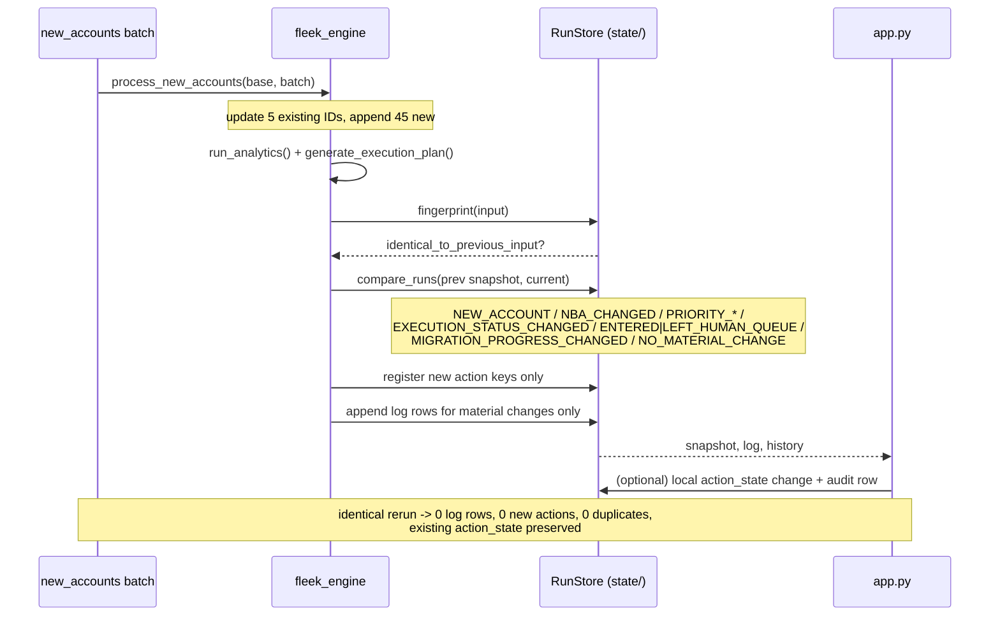

# Architecture

## Overview

**Legend:** blue nodes are automated and deterministic. Orange nodes are where a person makes a judgement. `guardrail_checks()` runs on every plan and its result is shown in the UI. A failing check is a defect to fix, not something to override. A static render is in [architecture.png](architecture.png).

## The daily loop

## Separation of concerns

| Layer | Decides | Code |
|---|---|---|
| Rules engine | **What** should happen: `primary_nba`, `execution_status`, `attention_priority` | `pipeline.py`, `config.py` |
| Execution planner | **How** it happens: playbook, owner role, channel, draft or brief, `action_state` | `execution.py`, `playbooks.py` |
| Run layer | **Whether anything is new**: fingerprint, change type, registry, log | `runs.py` |
| Validation | **Whether the plan is safe to show**: 19 checks | `validate.py` |
| Service layer | Baseline, upsert and identical-rerun orchestration, plus local workflow transitions | `demo.py` |
| UI | Presentation only. Every number comes from the engine output. | `app.py` |

## Automated vs human

| Automated (no person needed to decide) | Human judgement (the tool prepares, a person decides) |
|---|---|
| Scoring, segmentation, guardrail flags and NBA assignment | Retention conversations (Segments 2 and 8) |
| Choosing an owner role, channel, template and follow-up day | Verify / win-back: is this churn or a normal buying cadence? |
| Drafting automated nurture, reinforce and discovery-to-offer messages (preview) | Phase 1 migration Day 0 walkthrough, plus reviews at day 45 and day 90 |
| Change detection, deduplication and the log | Manual Review (borderline, February-sensitive, lumpy or broker-inconsistent accounts) |
| Guardrail validation | Key account migration sign-off |
| Migration progress status once 90-day inputs arrive | Service Model Review (depends on AM cost data we don't have) |
| | Resolving the HOLD on ACC-005 |
| | Assigning a named owner to Self Serve accounts in the human queue |

More detail is in [human_vs_automation.md](human_vs_automation.md).

## Production path (not built)

- Replace the CSV `RunStore` with database tables: snapshot, log and registry, with a unique constraint on `action_key`.
- Take input from a CRM or warehouse extract instead of the workbook. The ingestion contract is `REQUIRED_COLUMNS` in `config.py`.
- Send only `Ready — Automated` rows through an email or CRM tool, with suppression and unsubscribe handling. Human rows stay as tasks.
- Write outcome events (sent, replied, order, 90-day monitoring) back into the snapshot so that `In Progress` and `Completed` reflect real work.
